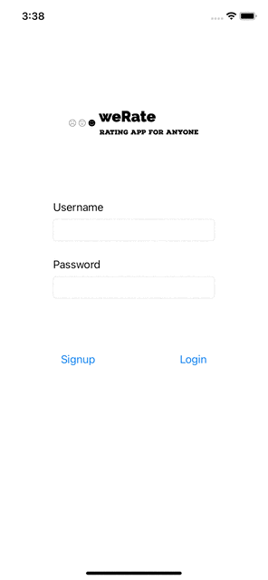

Unit 8: Group Milestone 
===

# weRate

## Table of Contents
1. [Overview](#Overview)
1. [Product Spec](#Product-Spec)
1. [Wireframes](#Wireframes)
1. [Schema](#Schema)

## Overview
### Description
In this project, you will design and implement a crowd-sourced voting/rating app for anyone.
Using the app, users can rate anything from food and coffee, to classes and labs. Also users are
able to see the ratings of the item of their interest, which is provided by their peers. Using this
crowd-sourced rating app, anyone with a valid email can post reviews/ratings on all sorts of
entities - courses, professors, labs, events, food, cafes, concerts, etc. The system should provide
guaranteed anonymity for the users.

### App Evaluation
- **Category:** Social Networking
- **Mobile:** This app would be primarily developed for mobile but would perhaps be just as viable on a computer, such as tinder or other similar apps. Functionality wouldn't be limited to mobile devices, however mobile version could potentially have more features.
- **Story:** Users can see ratings of different items in whatever category, and use these ratings to gauge their interests and make decisions.
- **Market:** Any individual could choose to use this app, and to keep it a safe environment, people would be organized into age groups.
- **Habit:** This app could be used as often or unoften as the user wanted depending on how deep their social life is, and what exactly they're looking for.
- **Scope:** First we would start with pairing people based on music taste, then perhaps this could evolve into a music sharing application as well to broaden its usage. Large potential for use with spotify, apple music, or other music streaming applications.

## Product Spec
### 1. User Stories (Required and Optional)

**Required Must-have Stories**
- [x] User should be able to signup and login for access to app. 
- [x] User should be able to rate/review entities anonymously. 
- [ ] User should be able to search for entities in meaningful ways both for lookup and to rate.  
- [x] Profile pages for each user 
- [ ] Settings (Accesibility, Notification, General, etc.) 
- [x] There are two different types of ratings and questions:
1) Polling questions: User can set up a polling question that may have any number
of options.
For example: Which Cafe is best on campus?
a.
Sturbucks
On Fourth - A Novel Café
C.
Philz Coffee
2) Rating questions: User set up a rating question with different point scales.

**Optional Nice-to-have Stories**

* If the number of useful votes for a rating question exceeds a threshold (e.g. 50
positive votes), the rating question stays open forever and will remain in the
system. Result for such rating questions would be visible to everyone always.

### 2. Screen Archetypes

* Login 
* Register - User signs up or logs into their account
   * Upon Download/Reopening of the application, the user is prompted to log in to gain access to their profile information to be properly matched with another person. 
   * ...
* Posting Screen 
   
* Profile Screen 
   * Allows user to upload a photo and fill in information that is interesting to them and others
* Voting Screen.
   * Allows user to vote or take the poll
* Settings Screen
   * Lets people change language, and app notification settings.

### 3. Navigation

**Tab Navigation** (Tab to Screen)

* Post Screen
* Profile
* Settings

**Flow Navigation** (Screen to Screen)
* Forced Log-in -> Account creation if no log in is available
* Vote Feed 
* Profile -> Text field to be modified. 
* Settings -> Toggle settings

## Wireframes

  
  

  
  

  
  

## Schema 
**Models**  
**Rating Posts**

|Property|Type|Description|
|--------|----|-----------|
|objectID|String|Unique id for the user post|
|numberRates|Dictionary|Associates each rating 1-5 (key) to the number of people that have voted that rating (value)|
|createdAt|DateTime|Date when post is created|
|updatedAt|DateTime|Date when post is last updated/when a user has last voted on it|

**Polling Posts**
|Property|Type|Description|
|--------|----|-----------|
|objectID|String|Unique id for the user post|
|numberVotes|Dictionary|Associates each type of vote in the poll (key) to the number of votes it has (value)|
|createdAt|DateTime|Date when post is created|
|updatedAt|DateTime|Date when post is last updated/when a user has last voted on it|

## Video Walkthrough

Here's a walkthrough of implemented user stories:

<!--  -->

